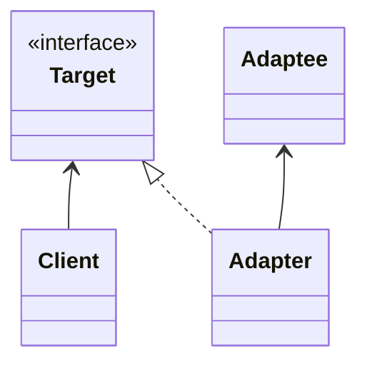
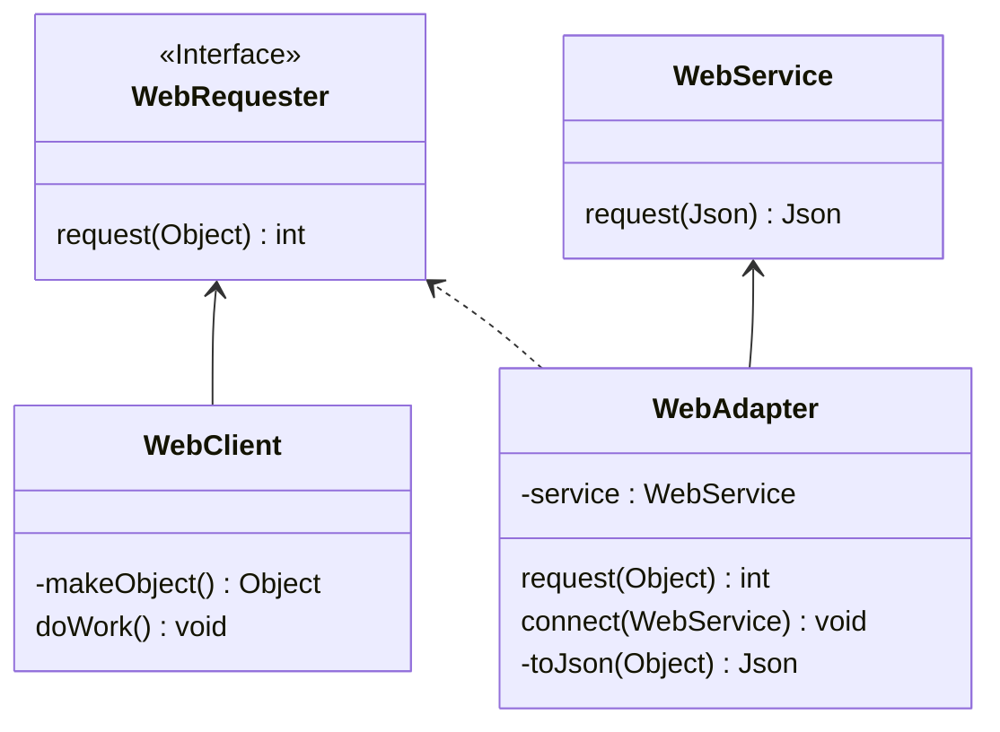

# Adapter

- Cliet: parte do sistema que deseja utilizar uma biblioteca de terceiros ou sistema externo.
- Adaptee: uma classe na biblioteca de terceiros ou sistema externo que será utilizado.
- Adapter: fica entre o cliente e o adaptee, implement uma interface target, a target interface será utilizada pelo cliente. O Adapter está em conformidade com as necessidades do cliente.  

O Cliente envia uma solicitação para o adaptador, usando a interface Target, o Adapter fará a tradução da solicitação do cliente para uma mensagem que o Adaptee entenda.  
O Adapter é uma wrapper class, ele envolve o Adaptee e apresenta uma nova interface, ou aparência, para o Cliente.  

1. Design a Interface Target.
2. Implementar a Interface Target no Adapter.
3. Enviar a request do cliente para o Adapter usando a Interface Target.  

O Adaptee fica escondido do cliente pela wrapper class Adapter.  

- Envolver o Adaptee e expor a Interface Target para a classe Cliente.
- Indiretamente alterar a Interface da classe Adaptee para uma que a classe Cliente atráves da implementação da Interface Target.
- Indiretamente traduzir a requisição do cliente em uma que o Adaptee espera.
- Reutilizar um Adaptee existente com uma interface incompativel.